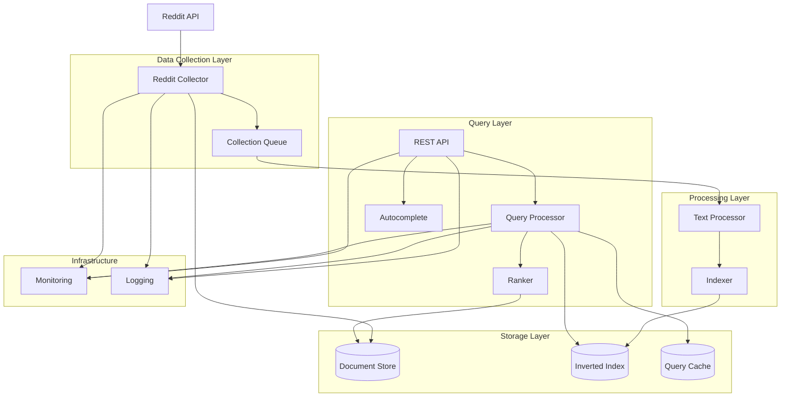
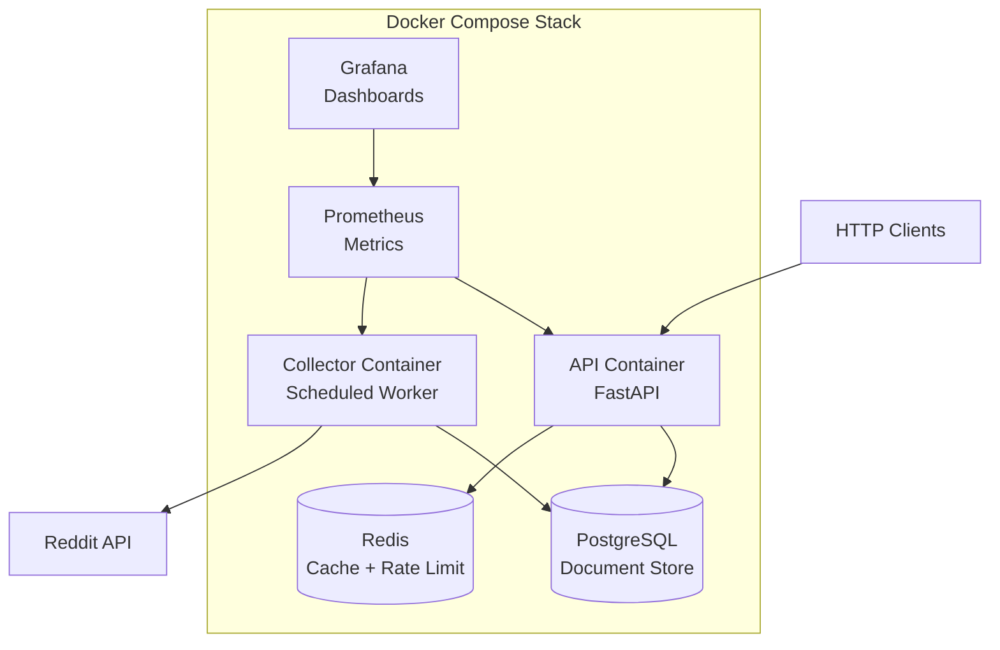

# Design Document: Reddit Search Engine

## Overview

The Reddit Search Engine is a production-quality search system that collects Reddit content, processes and indexes it, and provides fast, relevant search results. The system follows a microservices-inspired architecture with clear separation between data collection, processing, indexing, and query handling.

The design emphasizes:
- **Scalability**: Horizontal scaling for query processing, efficient indexing
- **Reliability**: Retry logic, circuit breakers, graceful degradation
- **Performance**: Caching, optimized data structures, concurrent processing
- **Observability**: Comprehensive logging, metrics, and health checks
- **Maintainability**: Clean architecture, dependency injection, configuration management

## Architecture

### High-Level Architecture



### Component Interaction Flow

**Data Collection Flow:**
1. Scheduler triggers Reddit Collector at configured intervals
2. Collector fetches posts/comments from Reddit API with concurrency
3. Collector checks for duplicates against Document Store
4. New documents are stored in Document Store
5. Documents are queued for processing
6. Text Processor cleans and tokenizes content
7. Indexer updates Inverted Index with processed tokens

**Query Processing Flow:**
1. Client sends search query to REST API
2. API checks Rate Limiter for client quota
3. Query Processor checks Query Cache for cached results
4. If cache miss, Query Processor retrieves matching documents from Inverted Index
5. Ranker scores documents using BM25 and multi-factor signals
6. Results are paginated and returned to client
7. Results are stored in Query Cache

## Components and Interfaces

### 1. Reddit Collector

**Responsibility:** Fetch content from Reddit API with reliability and efficiency.

**Key Design Decisions:**
- Use PRAW (Python Reddit API Wrapper) for simplified Reddit API interaction
- Implement worker pool pattern for concurrent fetching
- Use exponential backoff for retries (initial: 1s, max: 60s, multiplier: 2)
- Track processed post IDs in a bloom filter for fast duplicate detection
- Support multiple subreddits configured via environment variables

**Interface:**
```
class RedditCollector:
    def __init__(config: CollectorConfig, document_store: DocumentStore)
    def collect_posts(subreddit: str, limit: int) -> List[Document]
    def collect_comments(post_id: str) -> List[Document]
    def run_collection_cycle() -> CollectionResult
    def schedule_collection(interval: Duration)
```

**Configuration:**
- `REDDIT_CLIENT_ID`: Reddit API client ID
- `REDDIT_CLIENT_SECRET`: Reddit API client secret
- `REDDIT_USER_AGENT`: User agent string
- `SUBREDDITS`: Comma-separated list of subreddits
- `COLLECTION_INTERVAL`: Collection frequency (default: 1 hour)
- `CONCURRENT_REQUESTS`: Number of concurrent API requests (default: 5)
- `MAX_POSTS_PER_SUBREDDIT`: Posts to fetch per cycle (default: 100)

### 2. Text Processor

**Responsibility:** Clean, normalize, and tokenize text content.

**Key Design Decisions:**
- Use NLTK for tokenization and stopword removal
- Use Porter Stemmer for stemming (balance between speed and accuracy)
- Process documents in batches for efficiency
- Preserve original positions for phrase queries and snippet generation
- Handle Unicode and special characters gracefully

**Interface:**
```
class TextProcessor:
    def __init__(config: ProcessorConfig)
    def clean_html(text: str) -> str
    def tokenize(text: str) -> List[Token]
    def remove_stopwords(tokens: List[Token]) -> List[Token]
    def stem(tokens: List[Token]) -> List[Token]
    def process_document(document: Document) -> ProcessedDocument
    def process_batch(documents: List[Document]) -> List[ProcessedDocument]
```

**Processing Pipeline:**
1. Strip HTML tags using BeautifulSoup
2. Convert to lowercase
3. Tokenize on whitespace and punctuation using NLTK word_tokenize
4. Remove English stopwords from NLTK corpus
5. Apply Porter Stemmer
6. Return tokens with positions

### 3. Indexer

**Responsibility:** Build and maintain inverted index for fast document retrieval.

**Key Design Decisions:**
- Use dictionary-based inverted index: `{term: {doc_id: [positions], ...}}`
- Store term frequency and positions for each term-document pair
- Support incremental updates without full rebuilds
- Persist index to disk using memory-mapped files for fast loading
- Use write-ahead log for crash recovery

**Interface:**
```
class Indexer:
    def __init__(config: IndexConfig, storage: IndexStorage)
    def index_document(doc_id: str, tokens: List[Token])
    def update_document(doc_id: str, tokens: List[Token])
    def remove_document(doc_id: str)
    def get_postings(term: str) -> Dict[str, PostingsList]
    def get_document_frequency(term: str) -> int
    def get_total_documents() -> int
    def persist()
    def load()
```

**Data Structures:**
```
PostingsList:
    doc_id: str
    term_frequency: int
    positions: List[int]

InvertedIndex:
    term_to_postings: Dict[str, List[PostingsList]]
    document_lengths: Dict[str, int]
    total_documents: int
    average_document_length: float
```

### 4. Ranker

**Responsibility:** Score and rank documents based on relevance and other signals.

**Key Design Decisions:**
- Implement both TF-IDF and BM25 (BM25 as default)
- Use BM25 parameters: k1=1.5, b=0.75 (tunable via config)
- Combine text relevance with recency, popularity, and engagement
- Use weighted linear combination for multi-factor ranking
- Cache document statistics for performance

**Interface:**
```
class Ranker:
    def __init__(config: RankingConfig, index: Indexer, doc_store: DocumentStore)
    def calculate_tfidf(query_terms: List[str], doc_id: str) -> float
    def calculate_bm25(query_terms: List[str], doc_id: str) -> float
    def calculate_recency_score(timestamp: datetime) -> float
    def calculate_popularity_score(reddit_score: int) -> float
    def calculate_engagement_score(comment_count: int) -> float
    def rank_documents(query_terms: List[str], doc_ids: List[str]) -> List[ScoredDocument]
```

**Ranking Formula:**
```
final_score = w1 * bm25_score + w2 * recency_score + w3 * popularity_score + w4 * engagement_score

where:
- w1, w2, w3, w4 are configurable weights (default: 0.7, 0.15, 0.10, 0.05)
- bm25_score: BM25 relevance score (normalized to 0-1)
- recency_score: exp(-age_in_days / decay_constant), decay_constant = 7 days
- popularity_score: log(1 + reddit_score) / log(max_score_seen)
- engagement_score: log(1 + comment_count) / log(max_comments_seen)
```

### 5. Query Processor

**Responsibility:** Handle search queries end-to-end from input to results.

**Key Design Decisions:**
- Apply same text processing pipeline as documents
- Use two-phase retrieval: candidate generation + ranking
- Generate snippets with query term highlighting
- Support pagination with cursor-based approach for consistency
- Implement query expansion for better recall (optional)

**Interface:**
```
class QueryProcessor:
    def __init__(
        config: QueryConfig,
        text_processor: TextProcessor,
        indexer: Indexer,
        ranker: Ranker,
        cache: QueryCache
    )
    def process_query(query: str, page: int, page_size: int) -> SearchResults
    def generate_snippet(doc_id: str, query_terms: List[str]) -> str
    def get_matching_documents(query_terms: List[str]) -> Set[str]
```

**Search Results Structure:**
```
SearchResult:
    doc_id: str
    title: str
    url: str
    snippet: str
    score: float
    metadata: Dict[str, Any]

SearchResults:
    results: List[SearchResult]
    total_count: int
    page: int
    page_size: int
    query_time_ms: float
```

### 6. Query Cache

**Responsibility:** Cache frequent queries to reduce latency and load.

**Key Design Decisions:**
- Use Redis for distributed caching across multiple query processors
- Implement LRU eviction policy
- Set TTL to 5 minutes (configurable)
- Cache key: hash of (query_text, page, page_size)
- Invalidate cache entries when index is updated

**Interface:**
```
class QueryCache:
    def __init__(config: CacheConfig, redis_client: Redis)
    def get(query: str, page: int, page_size: int) -> Optional[SearchResults]
    def set(query: str, page: int, page_size: int, results: SearchResults)
    def invalidate(pattern: str)
    def clear()
    def get_stats() -> CacheStats
```

### 7. Autocomplete Service

**Responsibility:** Provide query suggestions based on prefix matching.

**Key Design Decisions:**
- Use trie (prefix tree) data structure for O(k) lookup where k is prefix length
- Build trie from both indexed terms and historical queries
- Weight suggestions by term frequency in corpus and query frequency
- Update trie incrementally as new documents are indexed
- Persist trie to disk for fast startup

**Interface:**
```
class AutocompleteService:
    def __init__(config: AutocompleteConfig)
    def get_suggestions(prefix: str, limit: int) -> List[Suggestion]
    def add_term(term: str, frequency: int)
    def record_query(query: str)
    def build_trie(terms: Dict[str, int])
```

**Trie Node Structure:**
```
TrieNode:
    children: Dict[char, TrieNode]
    is_end_of_word: bool
    frequency: int
    query_count: int
```

### 8. Rate Limiter

**Responsibility:** Control request rate to prevent abuse and ensure stability.

**Key Design Decisions:**
- Use sliding window algorithm with Redis for distributed rate limiting
- Track requests per client IP address
- Default limit: 100 requests per minute per IP
- Return HTTP 429 with Retry-After header when limit exceeded
- Whitelist internal services and monitoring endpoints

**Interface:**
```
class RateLimiter:
    def __init__(config: RateLimiterConfig, redis_client: Redis)
    def check_rate_limit(client_id: str) -> RateLimitResult
    def record_request(client_id: str)
    def get_remaining_quota(client_id: str) -> int
```

### 9. Analytics Service

**Responsibility:** Track and analyze search usage patterns.

**Key Design Decisions:**
- Log all queries with timestamp, result count, and latency
- Track click-through events with position and document ID
- Calculate CTR, average position, and query frequency
- Store analytics in time-series database (InfluxDB or TimescaleDB)
- Expose metrics via Prometheus endpoint

**Interface:**
```
class AnalyticsService:
    def __init__(config: AnalyticsConfig, storage: AnalyticsStorage)
    def log_query(query: str, result_count: int, latency_ms: float)
    def log_click(query: str, doc_id: str, position: int)
    def get_query_stats(query: str) -> QueryStats
    def get_popular_queries(limit: int) -> List[str]
```

### 10. REST API

**Responsibility:** Expose search functionality via HTTP endpoints.

**Key Design Decisions:**
- Use FastAPI framework for async support and automatic OpenAPI docs
- Implement middleware for logging, rate limiting, and error handling
- Use Pydantic models for request/response validation
- Support CORS for browser-based clients
- Version API endpoints (/api/v1/...)

**Endpoints:**

```
POST /api/v1/search
Request:
    query: str (required)
    page: int (default: 1)
    page_size: int (default: 10, max: 100)
Response:
    results: List[SearchResult]
    total_count: int
    page: int
    page_size: int
    query_time_ms: float

GET /api/v1/autocomplete?prefix={prefix}&limit={limit}
Response:
    suggestions: List[Suggestion]

GET /api/v1/health
Response:
    status: str ("healthy" | "degraded" | "unhealthy")
    components: Dict[str, ComponentHealth]
    timestamp: str

GET /api/v1/metrics
Response: Prometheus-formatted metrics

GET /api/v1/stats
Response:
    total_documents: int
    total_queries: int
    cache_hit_rate: float
    avg_query_latency_ms: float
```

## Data Models

### Document Model

```
Document:
    id: str (UUID)
    type: str ("post" | "comment")
    title: str
    content: str
    url: str
    author: str
    subreddit: str
    reddit_score: int
    comment_count: int
    created_utc: datetime
    collected_at: datetime
    processed: bool
```

### Processed Document Model

```
ProcessedDocument:
    doc_id: str
    tokens: List[Token]
    token_count: int
    unique_terms: Set[str]

Token:
    text: str
    position: int
    stem: str
```

### Index Storage Model

```
IndexEntry:
    term: str
    document_frequency: int
    postings: List[Posting]

Posting:
    doc_id: str
    term_frequency: int
    positions: List[int]
```

### Configuration Model

```
SystemConfig:
    reddit: RedditConfig
    collector: CollectorConfig
    processor: ProcessorConfig
    indexer: IndexConfig
    ranker: RankingConfig
    cache: CacheConfig
    rate_limiter: RateLimiterConfig
    api: APIConfig
    database: DatabaseConfig
    monitoring: MonitoringConfig

RedditConfig:
    client_id: str
    client_secret: str
    user_agent: str
    subreddits: List[str]

RankingConfig:
    algorithm: str ("tfidf" | "bm25")
    bm25_k1: float
    bm25_b: float
    text_weight: float
    recency_weight: float
    popularity_weight: float
    engagement_weight: float
    recency_decay_days: float
```

## Correctness Properties

*A property is a characteristic or behavior that should hold true across all valid executions of a system—essentially, a formal statement about what the system should do. Properties serve as the bridge between human-readable specifications and machine-verifiable correctness guarantees.*


### Data Collection Properties

**Property 1: Retry with exponential backoff**
*For any* Reddit API request that fails, the system should retry up to 3 times with exponentially increasing delays between attempts.
**Validates: Requirements 1.2**

**Property 2: Duplicate detection**
*For any* document, attempting to store it multiple times should result in only one copy existing in the document store.
**Validates: Requirements 1.3**

**Property 3: Complete metadata storage**
*For any* document stored by the collector, retrieving it should return all required metadata fields: title, URL, timestamp, author, subreddit, score, and comment count.
**Validates: Requirements 1.4**

### Text Processing Properties

**Property 4: HTML stripping completeness**
*For any* text containing HTML tags and entities, the text processor should produce output containing no HTML markup.
**Validates: Requirements 2.1**

**Property 5: Case normalization**
*For any* text input, the text processor should produce output where all alphabetic characters are lowercase.
**Validates: Requirements 2.2**

**Property 6: Tokenization boundary correctness**
*For any* text input, tokens should be split at whitespace and punctuation boundaries, with no tokens containing both word characters and punctuation.
**Validates: Requirements 2.3**

**Property 7: Stopword removal**
*For any* list of tokens containing English stopwords, the text processor should produce output with all stopwords removed.
**Validates: Requirements 2.4**

**Property 8: Position preservation**
*For any* text input, the positions assigned to tokens should be monotonically increasing and reflect the original order of tokens in the input.
**Validates: Requirements 2.6**

### Indexing Properties

**Property 9: Complete index entry storage**
*For any* document indexed, each unique term should have an index entry containing the document ID, term frequency, and all positions where the term appears.
**Validates: Requirements 3.1, 3.2, 3.3**

**Property 10: Index update idempotence**
*For any* document, indexing it, then updating it with new content, then retrieving its index entries should show only the entries from the updated content with no duplicates.
**Validates: Requirements 3.4**

**Property 11: Index persistence round-trip**
*For any* inverted index, persisting it to storage and then loading it back should produce an equivalent index with all terms, document IDs, frequencies, and positions preserved.
**Validates: Requirements 3.5, 12.2**

### Ranking Properties

**Property 12: TF calculation correctness**
*For any* query term and document, the term frequency should equal the number of times the term appears in the document.
**Validates: Requirements 4.1**

**Property 13: IDF calculation correctness**
*For any* term in the corpus, the inverse document frequency should equal log(total_documents / documents_containing_term).
**Validates: Requirements 4.2**

**Property 14: TF-IDF score composition**
*For any* single-term query and document, the TF-IDF score should equal the product of the term's frequency in the document and its inverse document frequency.
**Validates: Requirements 4.3**

**Property 15: Multi-term TF-IDF aggregation**
*For any* multi-term query and document, the total TF-IDF score should equal the sum of individual TF-IDF scores for each query term.
**Validates: Requirements 4.4**

**Property 16: Score-based sorting**
*For any* set of scored documents, the results should be ordered such that each document's score is greater than or equal to the next document's score.
**Validates: Requirements 4.5, 5.4**

**Property 17: BM25 length normalization**
*For any* two documents with identical term frequencies, the document closer to average length should receive a higher BM25 score than the document further from average length.
**Validates: Requirements 5.1**

**Property 18: BM25 formula correctness**
*For any* query term and document with known values for term frequency, document length, average document length, and IDF, the BM25 score should match the formula: IDF * (tf * (k1 + 1)) / (tf + k1 * (1 - b + b * docLength / avgDocLength)).
**Validates: Requirements 5.3**

**Property 19: Weighted multi-factor combination**
*For any* document with known component scores (relevance, recency, popularity, engagement) and configured weights, the final score should equal the weighted sum of all component scores.
**Validates: Requirements 6.1, 6.5**

**Property 20: Recency exponential decay**
*For any* two documents where one is older than the other, the older document should have a lower or equal recency score, following exponential decay.
**Validates: Requirements 6.2**

**Property 21: Popularity monotonicity**
*For any* two documents where one has a higher Reddit score than the other, the document with the higher Reddit score should have a higher or equal popularity score.
**Validates: Requirements 6.3**

**Property 22: Engagement monotonicity**
*For any* two documents where one has more comments than the other, the document with more comments should have a higher or equal engagement score.
**Validates: Requirements 6.4**

### Query Processing Properties

**Property 23: Query-document processing consistency**
*For any* text string, processing it as a query should produce the same tokens as processing it as document content.
**Validates: Requirements 7.1**

**Property 24: Retrieval completeness**
*For any* query, all documents in the index containing at least one query term should be included in the set of retrieved documents.
**Validates: Requirements 7.2**

**Property 25: Pagination correctness**
*For any* query with results, requesting different pages should return non-overlapping subsets of results, and the union of all pages should equal the complete result set.
**Validates: Requirements 7.4**

**Property 26: Result metadata completeness**
*For any* search result, it should contain all required fields: document ID, title, URL, snippet, score, and metadata.
**Validates: Requirements 7.5**

**Property 27: Snippet query term inclusion**
*For any* generated snippet for a query, the snippet should contain at least one query term from the original query.
**Validates: Requirements 7.6**

### Caching Properties

**Property 28: Cache hit equivalence**
*For any* query, the results returned from cache should be equivalent to the results that would be computed without cache.
**Validates: Requirements 8.2**

### Rate Limiting Properties

**Property 29: Request count tracking**
*For any* client making N requests within a time window, the rate limiter should track exactly N requests for that client.
**Validates: Requirements 9.1**

**Property 30: Sliding window burst prevention**
*For any* client making requests at a rate exceeding the limit, requests should be rejected regardless of when they occur within the time window, preventing bursts at window boundaries.
**Validates: Requirements 9.5**

### Autocomplete Properties

**Property 31: Suggestion limit enforcement**
*For any* prefix query, the autocomplete service should return at most 10 suggestions, even if more matches exist.
**Validates: Requirements 10.1**

**Property 32: Suggestion frequency ordering**
*For any* set of autocomplete suggestions, suggestions should be ordered such that each suggestion's frequency is greater than or equal to the next suggestion's frequency.
**Validates: Requirements 10.3**

### Analytics Properties

**Property 33: Click-through rate calculation**
*For any* query with recorded impressions and clicks, the calculated CTR should equal the number of clicks divided by the number of impressions.
**Validates: Requirements 11.3**

### Persistence Properties

**Property 34: Document storage round-trip**
*For any* document, storing it to the database and then retrieving it should produce a document with all fields equal to the original.
**Validates: Requirements 12.1**

### API Properties

**Property 35: Invalid input error handling**
*For any* API request with invalid input (malformed query, negative page number, excessive page size), the API should return HTTP 400 with a descriptive error message.
**Validates: Requirements 13.4**

**Property 36: JSON serialization round-trip**
*For any* valid API request and response, the data should be serializable to JSON and deserializable back to equivalent objects.
**Validates: Requirements 13.6**

### Security Properties

**Property 37: Input sanitization**
*For any* user input containing potentially malicious content (SQL injection patterns, script tags, command injection), the system should sanitize or reject the input before processing.
**Validates: Requirements 20.2**

## Error Handling

### Error Categories

1. **External Service Errors**
   - Reddit API failures (rate limits, timeouts, 5xx errors)
   - Database connection failures
   - Cache service unavailability

2. **Input Validation Errors**
   - Malformed queries
   - Invalid pagination parameters
   - Missing required fields

3. **Internal Processing Errors**
   - Text processing failures
   - Index corruption
   - Ranking calculation errors

### Error Handling Strategies

**Retry with Exponential Backoff:**
- Applied to: Reddit API calls, database operations
- Configuration: Initial delay 1s, max delay 60s, multiplier 2, max attempts 3
- Implementation: Use tenacity library or custom retry decorator

**Circuit Breaker Pattern:**
- Applied to: Reddit API, external services
- Configuration: Failure threshold 5, timeout 60s, half-open attempts 1
- Implementation: Use pybreaker library
- Behavior: Open circuit after threshold failures, attempt recovery after timeout

**Graceful Degradation:**
- Cache unavailable → Process queries without caching
- Autocomplete service down → Return empty suggestions
- Analytics service down → Skip analytics logging

**Error Response Format:**
```json
{
  "error": {
    "code": "INVALID_QUERY",
    "message": "Query must not be empty",
    "details": {
      "field": "query",
      "constraint": "min_length",
      "value": 1
    },
    "request_id": "uuid-correlation-id"
  }
}
```

**Logging Strategy:**
- Log all errors with ERROR level
- Include stack traces for unexpected errors
- Include correlation ID for request tracing
- Include contextual information (user input, system state)
- Never log sensitive information (credentials, PII)

## Testing Strategy

### Dual Testing Approach

The system requires both unit tests and property-based tests for comprehensive coverage:

**Unit Tests:**
- Specific examples demonstrating correct behavior
- Edge cases (empty input, boundary values, special characters)
- Error conditions (invalid input, service failures)
- Integration points between components
- Configuration validation

**Property-Based Tests:**
- Universal properties that hold for all inputs
- Comprehensive input coverage through randomization
- Invariant validation across operations
- Round-trip properties for serialization/deserialization
- Minimum 100 iterations per property test

### Property-Based Testing Configuration

**Framework:** Use Hypothesis for Python
- Minimum 100 iterations per test (configured via `@settings(max_examples=100)`)
- Each test must reference its design document property
- Tag format: `# Feature: reddit-search-engine, Property {number}: {property_text}`

**Example Property Test Structure:**
```python
from hypothesis import given, settings
from hypothesis.strategies import text, integers

@settings(max_examples=100)
@given(text())
def test_case_normalization(input_text):
    """
    Feature: reddit-search-engine, Property 5: Case normalization
    For any text input, the text processor should produce output 
    where all alphabetic characters are lowercase.
    """
    result = text_processor.normalize_case(input_text)
    assert result == result.lower()
    assert all(not c.isupper() for c in result if c.isalpha())
```

### Test Coverage Requirements

**Component-Level Tests:**
- RedditCollector: Retry logic, duplicate detection, metadata extraction
- TextProcessor: HTML stripping, tokenization, stemming, position tracking
- Indexer: Index construction, updates, persistence, retrieval
- Ranker: TF-IDF, BM25, multi-factor scoring, sorting
- QueryProcessor: Query processing, retrieval, pagination, snippets
- Cache: Hit/miss behavior, eviction, TTL
- RateLimiter: Request tracking, limit enforcement, sliding window
- Autocomplete: Prefix matching, frequency ordering, limit enforcement

**Integration Tests:**
- End-to-end search flow (collection → indexing → query → results)
- Cache integration with query processing
- Rate limiting integration with API
- Analytics integration with query processing

**Performance Tests:**
- Query latency under load (target: p95 < 200ms)
- Concurrent query handling (target: 100 concurrent)
- Index build time for large corpora
- Cache hit rate measurement

### Test Data Strategies

**Generators for Property Tests:**
- Random text with varying lengths and character sets
- Random HTML content with nested tags
- Random documents with controlled term distributions
- Random queries with 1-5 terms
- Random timestamps for recency testing
- Random scores and comment counts for ranking

**Fixtures for Unit Tests:**
- Sample Reddit posts with known characteristics
- Pre-built small indices for quick tests
- Known TF-IDF and BM25 score examples
- Edge cases (empty documents, single-word documents, very long documents)

### Continuous Integration

**Test Execution:**
- Run all tests on every commit
- Fail build if any test fails
- Generate coverage reports (target: >80% line coverage)
- Run property tests with increased iterations on main branch (1000 iterations)

**Test Organization:**
```
tests/
├── unit/
│   ├── test_collector.py
│   ├── test_text_processor.py
│   ├── test_indexer.py
│   ├── test_ranker.py
│   ├── test_query_processor.py
│   ├── test_cache.py
│   ├── test_rate_limiter.py
│   └── test_autocomplete.py
├── integration/
│   ├── test_search_flow.py
│   ├── test_api_endpoints.py
│   └── test_persistence.py
├── property/
│   ├── test_text_processing_properties.py
│   ├── test_indexing_properties.py
│   ├── test_ranking_properties.py
│   ├── test_query_properties.py
│   └── test_api_properties.py
└── performance/
    ├── test_query_latency.py
    └── test_concurrent_load.py
```

## Deployment Architecture

### Container Architecture



### Environment Configuration

**Required Environment Variables:**
```bash
# Reddit API
REDDIT_CLIENT_ID=your_client_id
REDDIT_CLIENT_SECRET=your_client_secret
REDDIT_USER_AGENT=SearchEngine/1.0

# Database
DATABASE_URL=postgresql://user:pass@db:5432/searchengine
DATABASE_POOL_SIZE=20

# Redis
REDIS_URL=redis://redis:6379/0
CACHE_TTL_SECONDS=300

# Application
SUBREDDITS=python,programming,technology
COLLECTION_INTERVAL_MINUTES=60
LOG_LEVEL=INFO
API_PORT=8000

# Ranking
RANKING_ALGORITHM=bm25
BM25_K1=1.5
BM25_B=0.75
TEXT_WEIGHT=0.7
RECENCY_WEIGHT=0.15
POPULARITY_WEIGHT=0.10
ENGAGEMENT_WEIGHT=0.05

# Rate Limiting
RATE_LIMIT_REQUESTS=100
RATE_LIMIT_WINDOW_SECONDS=60
```

### Monitoring and Observability

**Prometheus Metrics:**
```
# Query metrics
search_queries_total{status="success|error"}
search_query_duration_seconds{quantile="0.5|0.95|0.99"}
search_results_count{quantile="0.5|0.95|0.99"}

# Cache metrics
cache_hits_total
cache_misses_total
cache_hit_rate

# Collection metrics
reddit_requests_total{status="success|error"}
reddit_documents_collected_total
reddit_api_rate_limit_hits_total

# System metrics
index_size_bytes
index_terms_total
index_documents_total
```

**Health Check Endpoint:**
```json
{
  "status": "healthy",
  "timestamp": "2024-01-15T10:30:00Z",
  "components": {
    "database": {
      "status": "healthy",
      "latency_ms": 5
    },
    "redis": {
      "status": "healthy",
      "latency_ms": 2
    },
    "index": {
      "status": "healthy",
      "documents": 150000,
      "terms": 50000
    },
    "reddit_api": {
      "status": "healthy",
      "rate_limit_remaining": 45
    }
  }
}
```

### Scaling Considerations

**Horizontal Scaling:**
- API containers: Scale based on CPU/memory usage and request rate
- Collector containers: Scale based on number of subreddits and collection frequency
- Database: Use read replicas for query load distribution
- Redis: Use Redis Cluster for cache distribution

**Vertical Scaling:**
- Index size grows with document count (estimate: 100MB per 10K documents)
- Memory requirements for in-memory index (estimate: 2x index file size)
- Database storage grows with document count (estimate: 1KB per document)

**Performance Optimization:**
- Use connection pooling for database (pool size: 20)
- Implement query result caching (TTL: 5 minutes)
- Use batch processing for document indexing (batch size: 100)
- Implement index sharding for very large corpora (>1M documents)

## Security Considerations

**Authentication and Authorization:**
- API endpoints: Public read access, authenticated write access
- Admin endpoints: Require API key authentication
- Metrics endpoint: Restrict to internal network

**Input Validation:**
- Validate all user input against expected formats
- Sanitize HTML and special characters
- Limit query length (max: 500 characters)
- Limit page size (max: 100 results)

**Secrets Management:**
- Store Reddit API credentials in environment variables
- Use Docker secrets or cloud secret management in production
- Never log credentials or sensitive data
- Rotate API keys regularly

**Network Security:**
- Use HTTPS for all external communications
- Implement CORS with restricted origins
- Use rate limiting to prevent abuse
- Implement request size limits (max: 1MB)

## Future Enhancements

**Semantic Search:**
- Implement embedding-based search using sentence transformers
- Store embeddings in vector database (Pinecone, Weaviate)
- Combine keyword and semantic search scores

**Advanced NLP:**
- Named entity recognition for better indexing
- Query intent classification
- Automatic query expansion using synonyms

**Machine Learning:**
- Learning to rank using click-through data
- Personalized search results
- Anomaly detection for spam content

**Scalability:**
- Distributed indexing using Apache Spark
- Index sharding across multiple nodes
- Real-time indexing with streaming pipeline
